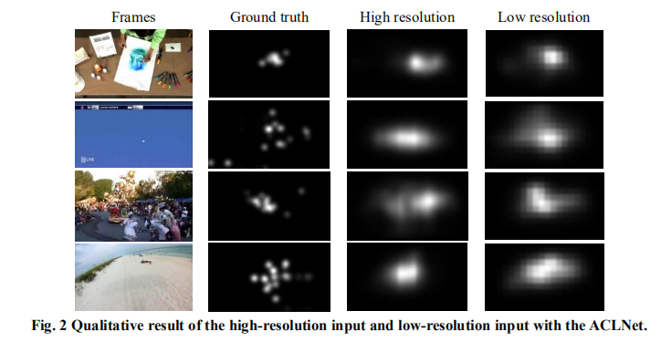

# ACLnet_Pytorch
It's a Pytorch implementation of [**ACLnet**](https://github.com/wenguanwang/DHF1K)
## Quick start
    pip install requirements.txt
## Train
    python main_pt.py
    
With pretrained weight

    python main_pt.py --weight <your weight>
  
## Test
    python main_pt.py --mode test --weight <your weight>
    
## Output
Trained only with the DHF1K dataset, tested on different resolutions of input frames
 
    
## References
[**ACLnet**](https://github.com/wenguanwang/DHF1K)

[**Convolutional LSTM**](https://github.com/automan000/Convolutional_LSTM_PyTorch)
